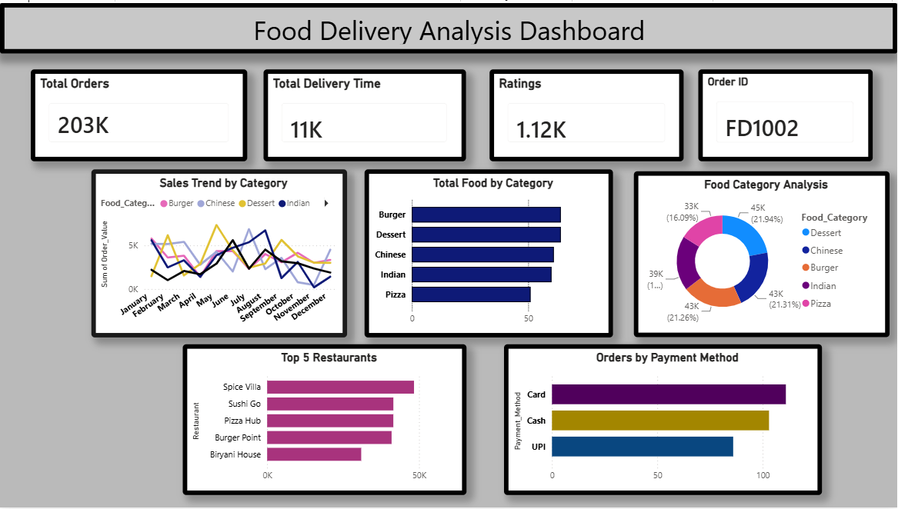

# Food Analysis Dashboard 🍔📊

## Overview
Welcome to the **Food Analysis Dashboard**! This Power BI project is designed to analyze food-related data, providing interactive visual insights and key metrics.

The primary file in this repository is a Power BI Template (`.pbit`). Unlike a standard `.pbix` file, this template retains the complete structural foundation of the project (data models, layouts, DAX measures, and themes) while remaining lightweight, as it does not store the underlying imported data.

## Dashboard Preview
Here is a look at the visual insights and metrics provided by the dashboard:


## Repository Contents
The `.pbit` file acts as a compressed package that includes all the necessary configurations to rebuild the dashboard. Its internal structure includes:
* **DataModelSchema:** The relational structure and logic mapping for the dashboard's data.
* **Report Layout & DiagramLayout:** The visual arrangement, pages, and interactive elements of the report.
* **Settings & Metadata:** The core configuration and project details.
* **Themes:** Pre-configured visual styling, including base themes like `CY26SU05.json`.

## Prerequisites
To open and use this project, you will need:
* **Power BI Desktop:** Ensure you have the latest version installed. You can download it for free from the [Microsoft Store](https://aka.ms/pbidesktopstore) or the [official website](https://powerbi.microsoft.com/desktop/).

## How to Run the Project

1. **Clone the Repository:**
   ```bash
   git clone https://github.com/pramodjadhav2004/Food_Analysis.git
   ```
2. **Open the File:** Locate `food project.pbit` in your local directory and double-click it to open it in Power BI Desktop.
3. **Connect Your Data:** Upon opening the template, Power BI will prompt you to provide the necessary credentials or parameters to connect to the raw data source.
4. **Refresh & View:** Once the data is successfully connected and loaded, the visuals will automatically populate.

## Tech Stack
* **Tool:** Microsoft Power BI
* **Data Transformation:** Power Query
* **Calculations:** DAX
* **File Format:** `.pbit` (Power BI Template)

## License
This project is open-source and available under the [MIT License](LICENSE).
